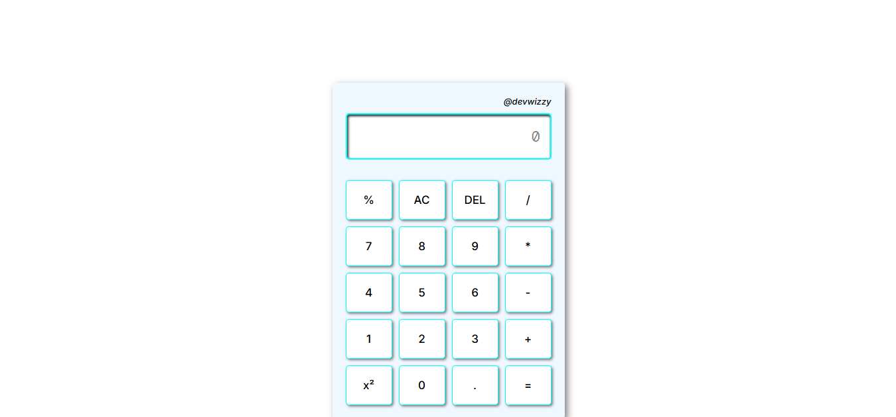

# Calculator App

## Table of contents

- [Overview](#overview)
- [Features](#features)
- [Built with](#built-with)
- [Preview](#preview)
- [Project Structure](#project-structure)
- [Links](#links)
- [What I learned](#what-i-learned)
- [Author](#author)

## Overview

A simple and responsive calculator built using HTML, CSS, and JavaScript. This project was created to practice DOM manipulation, event handling, and JavaScript logic while building a functional web application.

## Features

Basic arithmetic operations
Addition (+)
Subtraction (-)
Multiplication (×)
Division (÷)
Percentage calculation
Square (x²)
Clear all (AC)
Delete last character (DEL)
Error handling for invalid expressions
Prevents consecutive operators
Responsive and clean user interface

## Built With

HTML5
CSS3
JavaScript (ES6)

## Preview

## Project Structure

calculator/
│
├── index.html
├── index.css
├── main.js
└── README.md

## Links

- Live Site URL: [Calculator-web]()

## What I Learned

Through this project, I practiced:

DOM selection and manipulation
Event listeners
Conditional statements
JavaScript functions
String manipulation
Error handling with try...catch
Building interactive user interfaces
Writing cleaner and more maintainable JavaScript

## Author

Otuwe Wisdom

- Twitter - [@otutech](https://www.twitter.com/otutech)